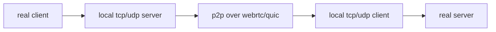
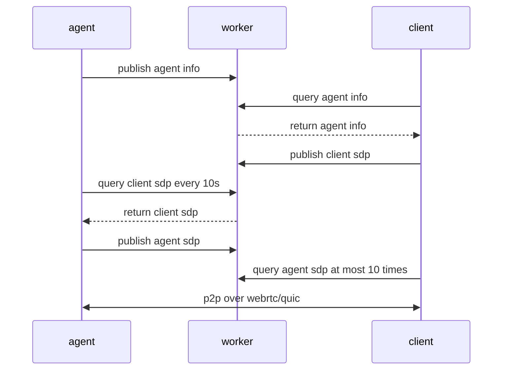

# modules

```mermaid
graph LR
    A[real client] --> B[local tcp/udp server]
    B[local tcp/udp server] --> C[p2p over webrtc/quic]
    C[p2p over webrtc/quic] --> D[local tcp/udp client]
    D[local tcp/udp client] --> E[real server]
```

# workflows

```mermaid
sequenceDiagram
    agent->>worker: publish agent info
    client->>worker: query agent info
    worker-->>client: return agent info
    client->>worker: publish client sdp
    agent->>worker: query client sdp every 10s
    worker-->>agent: return client sdp
    agent->>worker: publish agent sdp
    client->>worker: query agent sdp at most 10 times
    client<<->>agent: p2p over webrtc/quic
```
